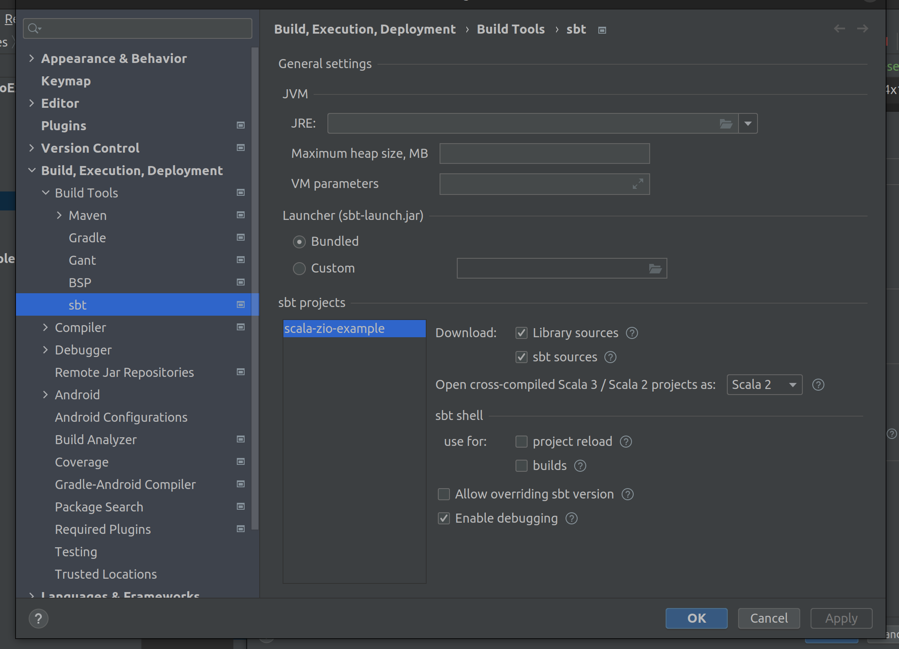
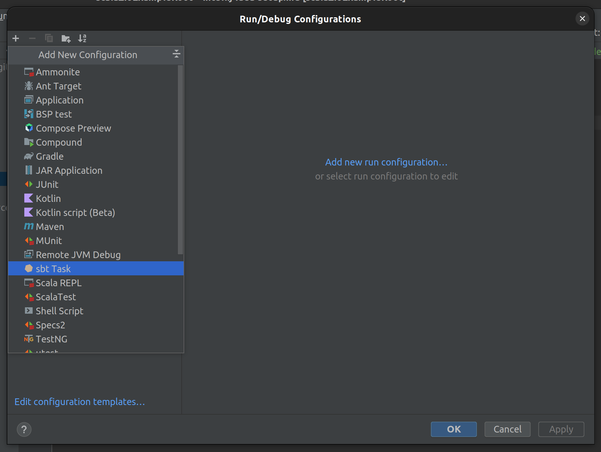
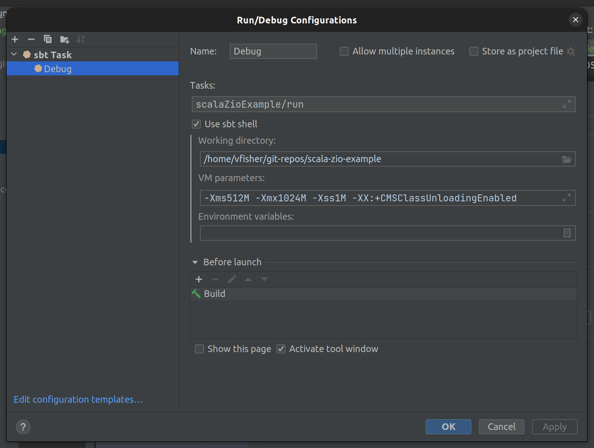

### Setting up debugger in Intellij IDEA

* Ensure that debugging is enabled for sbt
  
* Create a run configuration from the "sbt task" template
  
* Set the task to be `$name;format="camel"$/run`
  
    